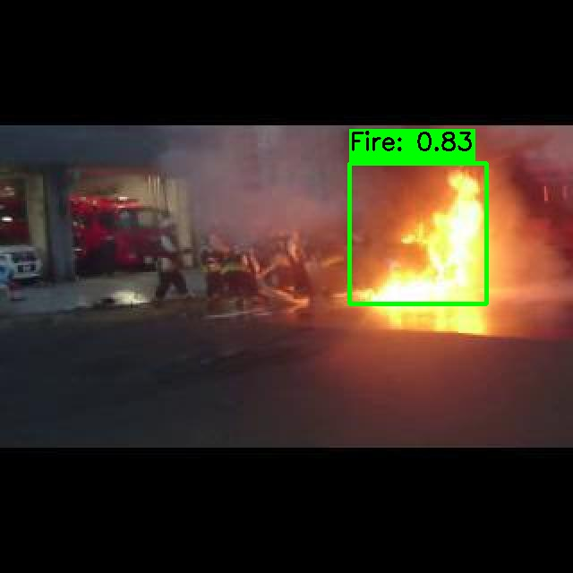

# Realtime Fire Detection Using YOLO Models

## Introduction

This repository hosts a collection of YOLO (You Only Look Once) models trained specifically for the purpose of fire detection. With the increasing risks of wildfires and urban fires, timely and accurate detection is crucial for early response and mitigation. Leveraging the speed and efficiency of YOLO models, our project aims to provide a robust solution for identifying fire instances in real-time video feeds and images.

## Table of Achieved Evaluation Metrics

| Dataset    | Metric                     | Value                |
| ---------- | -------------------------- | -------------------- |
| Validation | **Mean Average Precision** | **77.8%** @ 0.5(IoU) |
| Validation | **Precision**              | **79.6%**            |
| Validation | **Recall**                 | **73.4%**            |

## Test the model now!

<a href="https://universe.roboflow.com/vision-zz6rk/fire_detector-g4lir/model/7">
    
</a>

Click on the image above or visit [Roboflow](https://universe.roboflow.com/vision-zz6rk/fire_detector-g4lir/model/7) to test the fire detection model in your browser.

We have trained 7 different models on different datasets variations(versions), and finally deployed them on roboflow.Visit [Roboflow](https://universe.roboflow.com/vision-zz6rk/fire_detector-g4lir/dataset/7), to view different versions of the dataset and download them!

## Results

Here are some of the results from our models:




## Why YOLO for Fire Detection?

YOLO models are renowned for their fast detection speeds, making them ideal for real-time applications. Unlike traditional methods that might process an image in multiple stages, YOLO models predict multiple bounding boxes and class probabilities in a single forward pass. This capability allows our fire detection system to operate effectively in real-time scenarios, such as surveillance cameras in forests, urban areas, and industrial settings.

## Use Cases

- **Wildfire Monitoring:** Integration with drone and satellite imagery to detect early signs of wildfires, allowing for rapid response.
- **Urban Safety:** Monitoring urban environments and infrastructure, such as buildings and highways, for early detection of fire outbreaks.
- **Industrial Safety:** Ensuring safety in industrial and manufacturing settings by detecting fires in their incipient stage, preventing potential damage and ensuring workforce safety.
- **Home Security:** Integration with home security systems to provide real-time alerts on fire incidents, enhancing personal safety and property protection.

## Benefits

- **Speed and Efficiency:** Real-time detection capabilities allow for immediate identification and response to fire incidents.
- **Accuracy:** Trained on diverse datasets, our YOLO models are capable of detecting fires with high precision, reducing false positives.
- **Scalability:** Easily integrated into existing surveillance and monitoring systems without the need for complex hardware.
- **Cost-Effectiveness:** Provides a cost-efficient solution for fire detection compared to traditional methods, with lower operational costs and resource requirements.

## Installation

Setting up the Fire Detection project is straightforward and primarily requires PyTorch and the Ultralytics package. Follow the steps below to get started.

### Requirements

- Python 3.6 or later
- PyTorch (The installation command below will install it if not already installed)
- Ultralytics

### Pip Install Method (Recommended)

To install the necessary packages, run the following command in your Python environment:

```bash
!pip install torch ultralytics==8.0.196
```

## Getting Started

Quick start for training and testing:

[](https://colab.research.google.com/drive/1LivJRxLtOFb4fsJ7NAvJtoAVaEuVw8dM?usp=sharing)

To get started with testing the fire detection models, follow the steps below:

1. **Clone the Repository:**

```bash
git clone https://github.com/pavan98765/Fire_Detection.git
```

2. Open [Testing_and_evaluation.ipynb](Code/Testing_and_evaluation.ipynb) notebook to test the model on images, visulaize them and to realtime predictions through webcam!

3. Please open the [training_notebook.ipynb](Code/Training.py) to download the dataset from roboflow and start training the Model. You can choose different sizes(variations) of the model like nano,small, medium, large and xl. After the training is done you can evaluate and predict with the model.

## Contributing

We welcome contributions to the Fire Detection project! Whether it's through improving the model's accuracy,or expanding the dataset, your help is invaluable. If you encounter any problems or have suggestions, please feel free to open an issue or submit a pull request.

Thank you for your interest in our Fire Detection project. Together, we can make a significant impact on safety and emergency response times across the globe.
